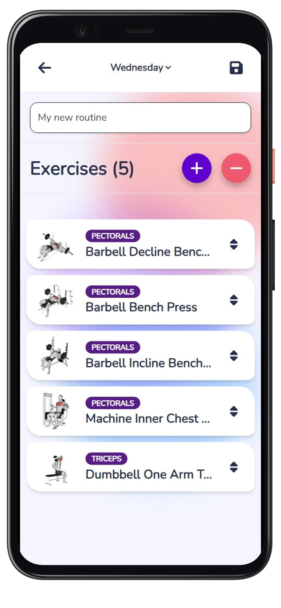

# Trainant
Application for detailed control and creation of exercise routines, weight and repetition tracking, exercise visualization.
(Preferred use on mobile devices)

*API, Firebase, Auth, CRUD, Tailwind, React Grid Layout*

#### [Try demo](https://trainant.web.app/)

## Project image 🖼️


### Table of contents 📃

- [Trainant](#trainant)
      - [Try demo](#try-demo)
  - [Project image 🖼️](#project-image-️)
    - [Table of contents 📃](#table-of-contents-)
  - [Starting 🚀](#starting-)
    - [Pre-requirements 📋](#pre-requirements-)
    - [Installation 🔧](#installation-)
  - [Deployment 📦](#deployment-)
  - [Built with 🛠️](#built-with-️)

## Starting 🚀
  
### Pre-requirements 📋

* [Git](https://git-scm.com/)
* [Node.js (npm)](https://nodejs.org/)
* [Firebase project](https://firebase.google.com/)
* [ExerciseDB API Key](https://v2.exercisedb.io/docs/static/index.htm)

### Installation 🔧

Local installation:

```bash
# Clone this repository
$ git clone https://github.com/juanpmachadob/trainant.git
```

---

**Setup:**
```bash
# Open terminal in project path
$ cd trainant

# Install dependencies
$ yarn install

# Copy .env file
$ cp .env.example .env

# Fill .env variables
```

## Deployment 📦

```bash
# Open terminal in project path and run
$ cd trainant
$ yarn dev
```
Open [http://localhost:5173](http://localhost:5173) to view it in your browser.

## Built with 🛠️

* [React](https://reactjs.org/)
* [React Redux](https://react-redux.js.org/)
* [Firebase](https://firebase.google.com/)
* [TailwindCSS](https://tailwindcss.com/)
* [React Grid Layout](https://github.com/react-grid-layout/react-grid-layout)
* [Valibot](https://valibot.dev/)
* [Sweet Alert](https://sweetalert2.github.io/)
* [Day.js](https://day.js.org/)
  
---
⌨️ with ❤️ by [Juan Pablo Machado](https://github.com/juanpmachadob) 😊 